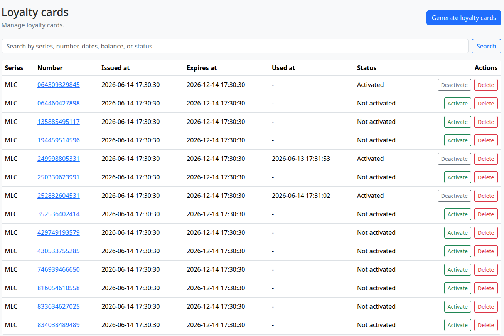
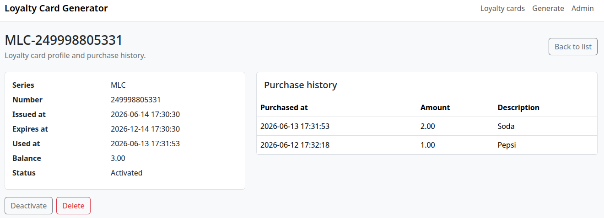
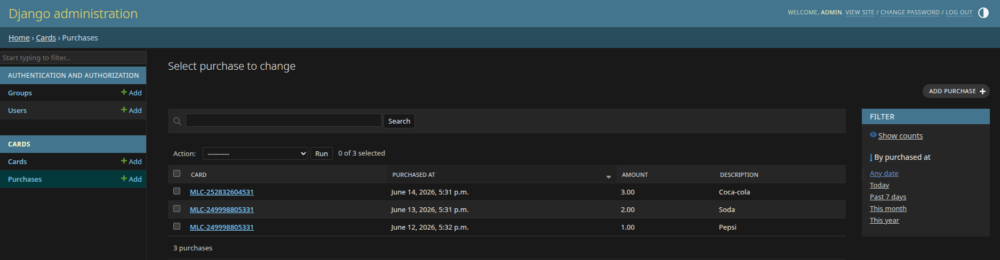

# Loyalty Card Generator

Django web application for managing loyalty cards.
The project was implemented as part of a test assignment.

## Features

- List loyalty cards with series, number, issue date, expiration date, and status.
- Search loyalty cards by series, number, dates, balance, and status.
- View a loyalty card profile with purchase history.
- Activate, deactivate, and delete loyalty cards.
- Generate loyalty card batches by series, quantity, and activity period.
- Mark expired loyalty cards automatically in views or manually via a management command.

Example of a loyalty card list:


Example of a loyalty card:


Managing the loyalty card list:


### Local Setup

Install dependencies:
```bash
uv sync
```

Copy and adjust environment variables if needed:
```bash
cp example.env .env
```

Start PostgreSQL:
```bash
docker compose up -d
```

Apply migrations:

```bash
uv run python manage.py migrate
```

Create an admin user:

```bash
uv run python manage.py createsuperuser
```

Run the application locally:

```bash
uv run python manage.py runserver
```

Open the loyalty card list at `http://127.0.0.1:8000/cards/`.

### Useful Commands

Expire outdated loyalty cards:

```bash
uv run python manage.py expire_cards
```

Format and lint:

```bash
uv run ruff format
uv run ruff check
```

Run type checking:

```bash
uv run mypy .
```

Run tests:

```bash
./scripts/test
```

The test suite uses the configured PostgreSQL database backend, so start
PostgreSQL with `docker compose up -d` before running it locally.

Run Django checks:

```bash
uv run python manage.py check
```
